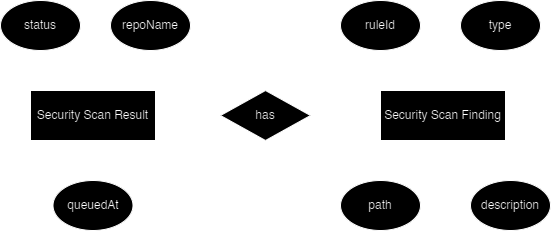

# Api

## Steps followed to setup

1. Created a directory called "api" and navigated into it
```
mkdir api
cd api
```

2. Created a node project
```
npm init -y
```

3. Installed express and typescript dependencies
```
npm install express
npm install typescript --save-dev
npm install @types/express --save-dev
```

4. Created typescript configuration file
```
npx tsc --init
```

5. Changed following configuration in `tsconfig.json` file
    1. Uncommented and set root directory
    ```
    rootDir: "./src"
    ```
    2. Uncommented and set output directory
    ```
    outDir: "./dist"
    ```
    3. Uncommented following flags
    ```
    "noImplicitAny": true,
    "strictNullChecks": true,
    "strictFunctionTypes": true,
    ```
6. Created directory called `src` inside `api` directory, then created a typescript file called `index.ts` inside `api` directory
7. Added following code to `index.ts` file
```
import express from 'express';

const app = express();

const port = 3030;

app.listen(port, () => {
  console.log(`Server is running on port ${port}`);
});
```
8. Installed nodemon and typescript node dependencies
```
npm install nodemon --save-dev
npm install ts-node --save-dev
```
9. Added following configuration to "scripts" section in `package.json` file
```
"build": "tsc --build",
"start": "node ./dist/index.js",
"start:dev": "nodemon ./src/index.ts"
```
10. Executed following command
```
npm run start:dev
```

## MongoDB connection

1. Installed mongoose dependencies
```
npm install mongoose
npm install mongoose @types/mongoose --save-dev
```

## Entity relationship diagram



## Api documentation

