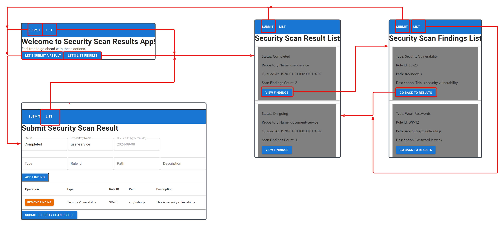

# Dashboard

## Steps followed to setup

1. Created react trypescript app called `dashboard` and navigated into it
```
npm create vite@latest dashboard -- --template react-ts
cd dashboard
```
2. Installed all dependencies
```
npm install
```
3. Executed following command
```
npm run dev
```

## Nav bar and routing

1. Installed react rounter dom dependency
```
npm install react-router-dom
npm install @types/react-router-dom --save-dev
```

## React material ui

1. Installed react material ui dependencies
```
npm install @mui/material @emotion/react @emotion/styled
```

## UI mockup

